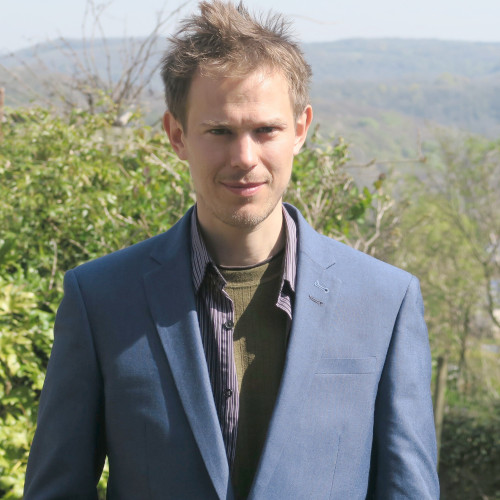

:::{.landing-shell}

:::{.landing-profile .landing-panel}
{.landing-avatar}

## Robin Lovelace {.landing-name}

<div class="landing-links">
  <a class="btn btn-outline-secondary btn-sm" href="mailto:r.lovelace@leeds.ac.uk">Email</a>
  <a class="btn btn-outline-secondary btn-sm" href="https://twitter.com/robinlovelace" target="_blank" rel="noopener">Twitter</a>
  <a class="btn btn-outline-secondary btn-sm" href="https://github.com/robinlovelace" target="_blank" rel="noopener">GitHub</a>
  <a class="btn btn-outline-secondary btn-sm" href="https://www.youtube.com/c/RobinLovelace" target="_blank" rel="noopener">YouTube</a>
  <a class="btn btn-outline-secondary btn-sm" href="https://fosstodon.org/web/@robinlovelace" target="_blank" rel="noopener">Mastodon</a>
  <a class="btn btn-outline-secondary btn-sm" href="https://scholar.google.co.uk/citations?user=xDJHVCAAAAAJ&hl=en" target="_blank" rel="noopener">Google Scholar</a>
</div>
:::

:::{.landing-main .landing-panel}

```{=html}
<ul class="nav nav-pills mb-3" id="bio-tabs" role="tablist">
  <li class="nav-item" role="presentation">
    <button class="nav-link active" id="bio-tab" data-bs-toggle="tab" data-bs-target="#bio-pane" type="button" role="tab" aria-controls="bio-pane" aria-selected="true">Biography</button>
  </li>
  <li class="nav-item" role="presentation">
    <button class="nav-link" id="experience-tab" data-bs-toggle="tab" data-bs-target="#experience-pane" type="button" role="tab" aria-controls="experience-pane" aria-selected="false">Experience</button>
  </li>
  <li class="nav-item" role="presentation">
    <button class="nav-link" id="education-tab" data-bs-toggle="tab" data-bs-target="#education-pane" type="button" role="tab" aria-controls="education-pane" aria-selected="false">Education</button>
  </li>
  <li class="nav-item" role="presentation">
    <button class="nav-link" id="interests-tab" data-bs-toggle="tab" data-bs-target="#interests-pane" type="button" role="tab" aria-controls="interests-pane" aria-selected="false">Interests</button>
  </li>
</ul>
<div class="tab-content" id="bio-tabs-content">
  <div class="tab-pane fade show active" id="bio-pane" role="tabpanel" aria-labelledby="bio-tab" tabindex="0">
    <p>I am a <a href="https://environment.leeds.ac.uk/transport/staff/953/dr-robin-lovelace">Professor of Transport Data Science</a> at the <a href="https://www.leeds.ac.uk/">University of Leeds</a> <a href="https://environment.leeds.ac.uk/transport">Institute for Transport Studies</a>, where I build open tools and reproducible workflows for evidence-based transport planning.</p>
    <p>I share code, methods, and writing on <a href="https://github.com/robinlovelace">GitHub</a> and in the <a href="./posts/">posts section</a>. If you would like to collaborate, feel free to <a href="mailto:r.lovelace@leeds.ac.uk">email me</a>.</p>
    <div class="mt-3">
      <a href="./projects/" class="btn btn-primary me-2">Current projects</a> <a href="./publications/" class="btn btn-outline-secondary">Publications</a>
    </div>
  </div>
  <div class="tab-pane fade" id="experience-pane" role="tabpanel" aria-labelledby="experience-tab" tabindex="0">
    <ul class="timeline-list list-unstyled ps-1 pt-2">
      <li class="mb-3">
        <div class="d-flex justify-content-between flex-wrap">
          <strong>Associate Professor</strong>
          <span class="text-muted small">2019 - Present</span>
        </div>
        <div class="text-muted small"><a href="https://environment.leeds.ac.uk/transport/staff/953/dr-robin-lovelace" target="_blank">University of Leeds</a> (Leeds, UK)</div>
        <div class="small mt-1">Teaching and researching transport data science. Lead developer of the TDS MSc module.</div>
      </li>
      <li class="mb-3">
        <div class="d-flex justify-content-between flex-wrap">
          <strong>Principal Investigator</strong>
          <span class="text-muted small">2019 - Present</span>
        </div>
        <div class="text-muted small"><a href="https://saferactive.org" target="_blank">SaferActive</a> (UK)</div>
        <div class="small mt-1">Responsibilities include project management, data analysis, and active travel safety modelling.</div>
      </li>
      <li class="mb-3">
        <div class="d-flex justify-content-between flex-wrap">
          <strong>Lead Developer</strong>
          <span class="text-muted small">2015 - Present</span>
        </div>
        <div class="text-muted small"><a href="https://www.pct.bike/" target="_blank">Propensity to Cycle Tool (PCT)</a> (UK)</div>
        <div class="small mt-1">Leading development of the R code, spatial model pipelines, and interactive web mapping dashboard.</div>
      </li>
      <li>
        <div class="d-flex justify-content-between flex-wrap">
          <strong>Principal Investigator</strong>
          <span class="text-muted small">2017 - 2018</span>
        </div>
        <div class="text-muted small"><a href="https://cyipt.bike" target="_blank">Cycling Infrastructure Prioritisation Tool (CyIPT)</a> (UK)</div>
        <div class="small mt-1">Managed project pipelines, spatial data analytics, and cycle infrastructure planning models.</div>
      </li>
    </ul>
  </div>
  <div class="tab-pane fade" id="education-pane" role="tabpanel" aria-labelledby="education-tab" tabindex="0">
    <ul class="timeline-list list-unstyled ps-1 pt-2">
      <li class="mb-3">
        <div class="d-flex justify-content-between flex-wrap">
          <strong>PhD in Transport and Energy</strong>
          <span class="text-muted small">2013</span>
        </div>
        <div class="text-muted small">University of Sheffield (Sheffield, UK)</div>
        <div class="small mt-1">Research focused on spatial microsimulation, energy futures, and transportation analysis.</div>
      </li>
      <li class="mb-3">
        <div class="d-flex justify-content-between flex-wrap">
          <strong>MSc in Environmental Science & Management</strong>
          <span class="text-muted small">2009</span>
        </div>
        <div class="text-muted small">University of York (York, UK)</div>
      </li>
      <li>
        <div class="d-flex justify-content-between flex-wrap">
          <strong>BSc in Environmental Geography</strong>
          <span class="text-muted small">2008</span>
        </div>
        <div class="text-muted small">University of Bristol (Bristol, UK)</div>
      </li>
    </ul>
  </div>
  <div class="tab-pane fade" id="interests-pane" role="tabpanel" aria-labelledby="interests-tab" tabindex="0">
    <p class="pt-1 small text-muted">Primary research fields and software development interests:</p>
    <div class="d-flex flex-wrap gap-2 pt-1">
      <span class="interest-badge badge bg-primary-subtle text-primary border border-primary-subtle">Geocomputation</span>
      <span class="interest-badge badge bg-success-subtle text-success border border-success-subtle">Transport Modelling</span>
      <span class="interest-badge badge bg-info-subtle text-info border border-info-subtle">Active Travel Uptake</span>
      <span class="interest-badge badge bg-warning-subtle text-warning border border-warning-subtle">Reproducible Data Analysis</span>
      <span class="interest-badge badge bg-danger-subtle text-danger border border-danger-subtle">Decarbonising Transport Systems</span>
      <span class="interest-badge badge bg-primary-subtle text-primary border border-primary-subtle">Open Source Software</span>
      <span class="interest-badge badge bg-secondary-subtle text-secondary border border-secondary-subtle">Spatial Data Science</span>
    </div>
  </div>
</div>
```

:::

:::{.landing-updates .landing-panel}
### Upcoming and Recent Talks and Events

:::{#upcoming-events}
:::

:::
:::
