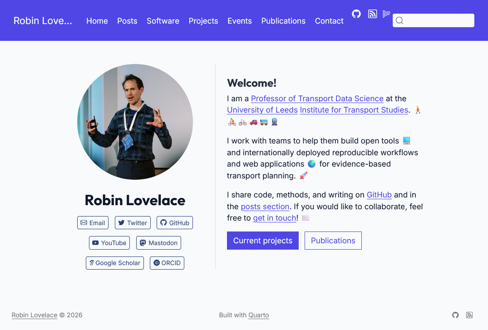

Following in the footsteps of reproducible research rolemodels including [Nicola Rennie](https://nrennie.rbind.io/blog/hugo-quarto-website/), [Andrew Heiss](https://www.andrewheiss.com/uses/) and [Jakub Nowosad](https://jakubnowosad.com/), I've finally migrated my website to Quarto!

Some brief notes on the process follow, it's worth it but there are some gotchas and things to consider.

## Why migrate? Wowchemy and HugoBlox closed ecosystems

I explored options including migrating from Wowchemy to [HugoBlox](https://github.com/HugoBlox).
If you search for Wowchemy on GitHub today, there are no public repositories under [github.com/wowchemy](https://github.com/wowchemy).
The project activity has moved under the HugoBlox organisation: [github.com/HugoBlox](https://github.com/HugoBlox).

So one path was to stay in the Hugo ecosystem and migrate templates and content there.
The other path was to simplify and move to Quarto for content-first publishing and easier long-term maintenance.

I went with Quarto.
Despite its cons of being slower to generate html (quarto preview can take minutes for large sites, something the team is working on in the currently-experimental [quarto-dev/q2](https://github.com/quarto-dev/q2) repository) and being less flexible in some ways than Hugo, Quarto is unbeatable for scientific and reproducible content.

## Converting content

For anyone sitting on years of posts, events, and publication metadata, this is the kind of utility that turns a risky migration into a manageable one.

Another useful piece of the Quarto ecosystem is the Academicons extension workflow documented here: <https://rmflight.github.io/posts/2022-12-03-using-academicons-in-your-quarto-blog/>.
[Academicons](https://jpswalsh.github.io/academicons/) are great for academic profile links (ORCID, Google Scholar and similar), but the experience is still more extension-oriented and less integrated than the tightly packaged academic site features available in HugoBlox.
That is one reason I think Quarto could benefit from more high-level, Wowchemy/HugoBlox-style extensions for academic websites.

## Legacy site archive

The old version of my site remains online here:

- <http://robinlovelace.net/old-site/>

That gives a stable reference point while the new stack evolves.

## Domain and GitHub Pages setup

With help from [Jakub Nowosad](https://jakubnowosad.com/), I configured my domain so GitHub Pages can serve from the apex domain setup.
The practical result is that repositories with `gh-pages` outputs appear automatically under robinlovelace.net.

For example:

- New URL: <https://robinlovelace.net/rs5c/>
- Previous URL: <https://robinlovelace.github.io/rs5c/>

The old GitHub-hosted URL now redirects, so links continue to work while the canonical home is on robinlovelace.net.

## Next steps

I'm still looking into how to better automate things.
I've set-up GitHub Actions to create Netlify previews on each pull request, and am looking to set-up a regular workflow to run every month or so to update citations.
Overall, I suggest keeping it fairly simple, with themes and extensions that are well-supported and maintained.

I've also found that nothing quite beats the out-of-the-box Publications page in HugoBlox for managing publications, so I'm looking into ways to automate the creation of a similar page in Quarto.

Check out the source code of my newly updated website if interested in any case and feel free to reach out, e.g. using the newly set-up [Giscus](https://giscus.app/) comments system on this site.
Hoping this new set-up will encourage me to blog more. Watch this space!
