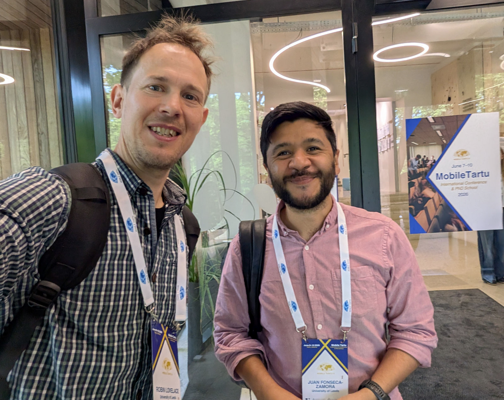
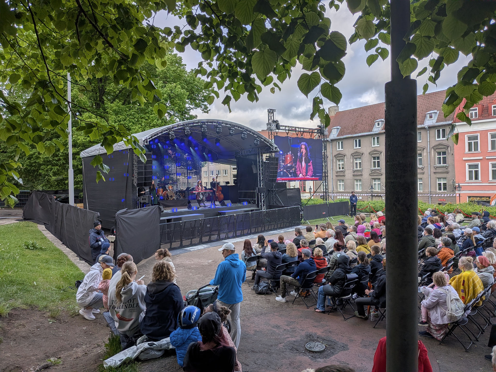
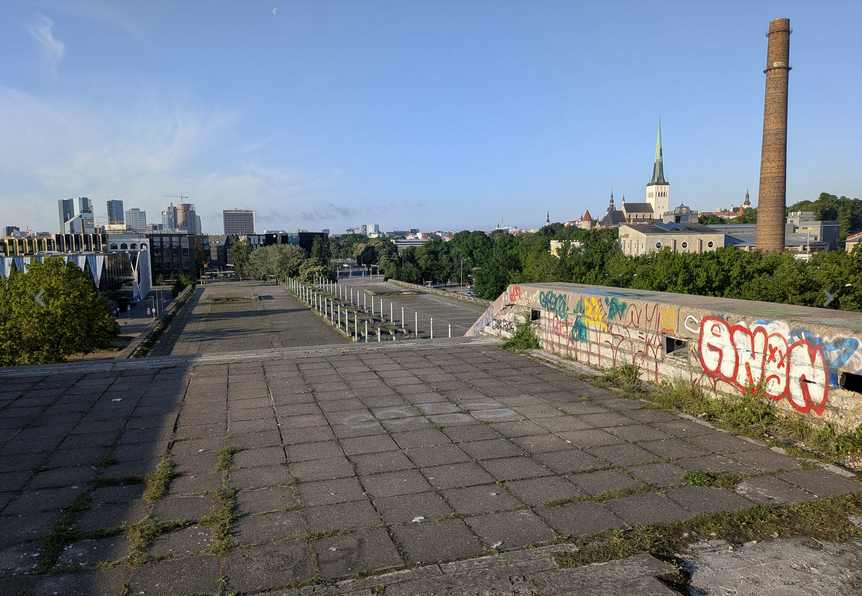
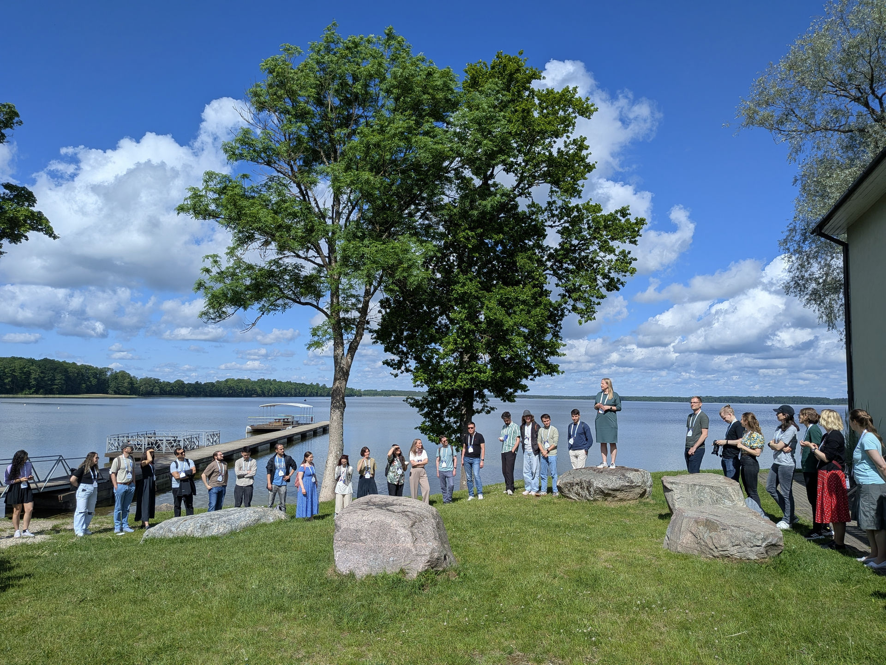
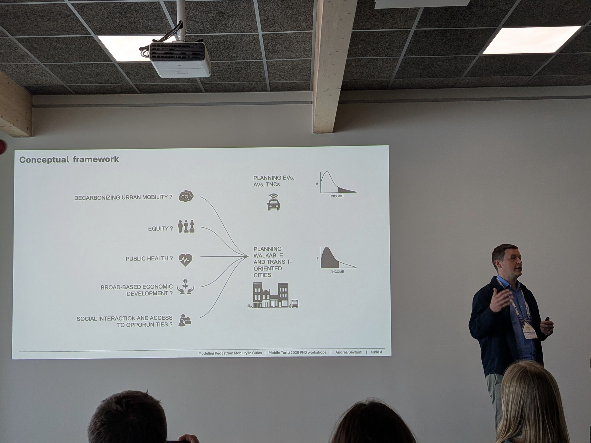
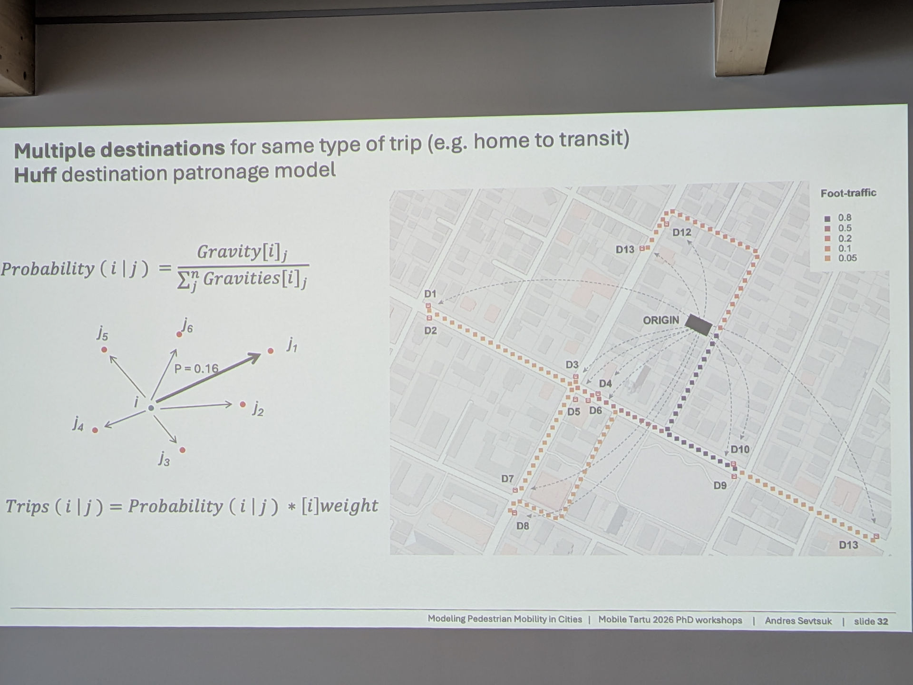
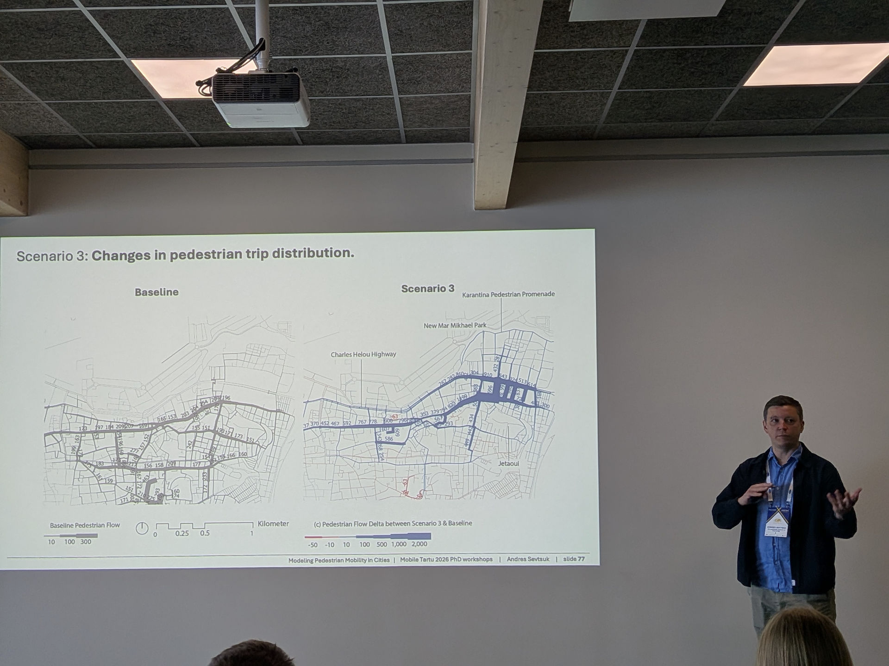

Last week I attended the [10th Mobile Tartu Conference](https://mobiletartu.ut.ee/).
In this post I share some reflections on the event, links to some of the great materials presented there, plus a few photos.
After reading it you should have a good idea about what Mobile Tartu is all about and, if you're a mobility researcher interested in emerging data sources and reproducible research, why you should consider applying to attend the next one in 2028.

The short version: it was a blast and you should visit Estonia (and if interested in reproducible transport planning check out our free and open access workshop materials, and the results from workshop attendees)!

## Introduction

I first attended Mobile Tartu 2 years previously as an [invited speaker](https://robinlovelace.net/posts/2024-06-15-tartu2024/).
This year, I was invited to [deliver a workshop ](https://robinlovelace.net/events/mobile-tartu-2026/)for the PhD school that precedes the conference.
I was happy to accept, resulting in the 2 half-day course Data Science for Transport Planning delivered by me and my ITS colleague and PhD student Juan Fonseca, shown in the photo.

## Tallinn and Estonian culture

Before the event we got to spend some time exploring Tallinn.
There was an outdoor festival taking place, which featured live music, the ideal way to acclimatise to the Estonian culture.
Although I couldn't understand a single word of the lyrics I could appreciate the catchy and brilliantly executed songs.
It was only several days later that I found out that it was an Estonian-language progressive pop band called [Lonitseera](https://lonitseera.ee/eng/meist/).
Their music is available from their [website](https://lonitseera.ee/eng/muusika/), from [YouTube ](https://www.youtube.com/@lonitseera1403)and beyond, highly recommended!

The next day, on Sunday 7th June, it was time to go to the PhD school venue.
I found time to go for a quick run in the morning, and ended up at [Linnahall](https://en.wikipedia.org/wiki/Linnahall), a largely abandoned venue constructed for the 1980 Olympic games.
Climbing up the huge concrete structure gave me an impression of how much Tallinn, and the whole of Estonia, has changed since regaining independence following a referendum in which almost [80% of its population voted for independence from the former Soviet Union in 1991](https://en.wikipedia.org/wiki/Estonia#Independence_restored).

## The Mobile Tartu PhD School

While the main Mobile Tartu conference is always hosted at the [University of Tartu](https://ut.ee/en) (founded in 1632, [closely following](https://en.wikipedia.org/wiki/List_of_oldest_universities_in_continuous_operation) other early universities like Oxford, Cambridge, Salamanca and Uppsala, and more than 200 years earlier than the [University of Leeds](https://www.leeds.ac.uk/) where I'm based), the [PhD School](https://mobiletartu.ut.ee/workshops-and-academic-lecture/) that precedes it moves to a new location each time.
For Mobile Tartu 2026 the venue was an Ice Age museum with impressive sculptures of Woolly Mamoths and good views of the Estonian countryside on our doorstep.
The venue was also on the edge of a lake ([Saadjärv](https://www.openstreetmap.org/relation/4567875#map=14/58.54080/26.64974&layers=C)) which was the ideal place to cool off after taking a sauna to celebrate completing the first day's work.

As ice-breaker activities, we were asked to create a map of the world in the space shown below and find things we had in common.
This was a great way to get to know each other and to see the impressive international spread of participants.

Before the workshops began there was a talk by Andres Sevstuk, who was doing a research visit to the University of Cambridge, UK, as part of a [sabbatical](https://en.wikipedia.org/wiki/Sabbatical).
(Coincidentally, as part of the research visit, Andres is organising a symposium on [modelling active travel as part of the Applied Urban Modelling conference, where I will also be presenting](https://robinlovelace.net/events/aum2026/).)

Some photos from the talk, which was excellent, are provided below.

<!--  -->

<iframe src="https://www.linkedin.com/embed/feed/update/urn:li:share:7469324956632510464?collapsed=1" height="645" width="504" frameborder="0" allowfullscreen="" title="Embedded post"></iframe>

There was a good link between Andres's talk and the topic of his workshop: modelling pedestrian movements using the Python package madina [@sevtsuk2025].
There were 4 workshops in total, with links to the workshop materials in the links where I could find them:

1. Data Science for Transport Planning: from origin-destination to route network datasets (Robin Lovelace and Juan Fonseca Zamora, our workshop)  
  - See the [workshop homepage](https://tdscience.github.io/tartu26/) for links to the materials, code and slides.
2. Modelling Pedestrian Mobility in Cities: Tools for Sustainable Urban Design (Andres Sevtsuk)  
3. Correcting Biases in Mobile Phone Mobility Data: The DEBIAS Framework (Francisco Rowe and Carmen Cabrera)  
  - This workshop was based on the in-progress [`debiasR` R package](https://de-bias.github.io/debiasR/index.html) and it's open [documentation](https://de-bias.github.io/debiasR/articles/v03-getting-set-up.html) 
4. Regional Inequities in Accessibility: Comparative Analysis of GTFS and Passenger Counts (Anto Aasa, Ago Tominga and Martin Haamer)  

## Our workshop: Data Science for Transport Planning

Our workshop built on the [Data Science for Transport Planning](https://environment.leeds.ac.uk/dir-record/shortcourses/1179/data-science-for-transport-planning) continuous professional development (CPD) courses we have delivered for practitioners, plus the [Tools and Skills for Reproducible Transport Research](https://tdscience.github.io/course) that Juan and I delivered last year at the EIT Summer School in Lisbon.

This time we focussed specifically on using origin-destination data from the [{spanishoddata} R package](https://ropenspain.github.io/spanishoddata/).
We also included demonstrations of how to use the [OpenStreetMap](https://www.openstreetmap.org/) data with R and Python to generate estimates of flow on networks.
We had 4 teams of 3-4 participants and each was tasked with developing a reproducible workflow to answer a research question of their choice using the data and tools we had introduced.

A challenge for participants was to develop an understanding of the data and tools provided, while simultaneously developing their own research.
It was a bit like trying to compress a research project into 2 half-days or, trying to fly a plane while building it.
An additional challenge that we set the participants was to present their work using slides generated Quarto and hosted on the course website.
As outlined below, every team aced it, resulting in 4 excellent presentations on the final day of the workshop, professional-looking interactive slides that others can benefit from, and the experience of committing code and opening pull requests to a GitHub repository, an impressive achievement given that many of the participants had never used GitHub, let along GitHub Codespaces or Pull Requests before.

The final presentations were as follows:

Beyond learning about new datasets and data science tools, the workshop also taught new ways to collaborate and communicate research findings, which is a key part of the reproducible research ethos.

<iframe src="https://www.linkedin.com/embed/feed/update/urn:li:share:7470000166335340545?collapsed=1" height="669" width="504" frameborder="0" allowfullscreen="" title="Embedded post"></iframe>

Well done to all the participants!

## 

<iframe src="https://www.linkedin.com/embed/feed/update/urn:li:share:7470474608744509441?collapsed=1" height="603" width="504" frameborder="0" allowfullscreen="" title="Embedded post"></iframe>

