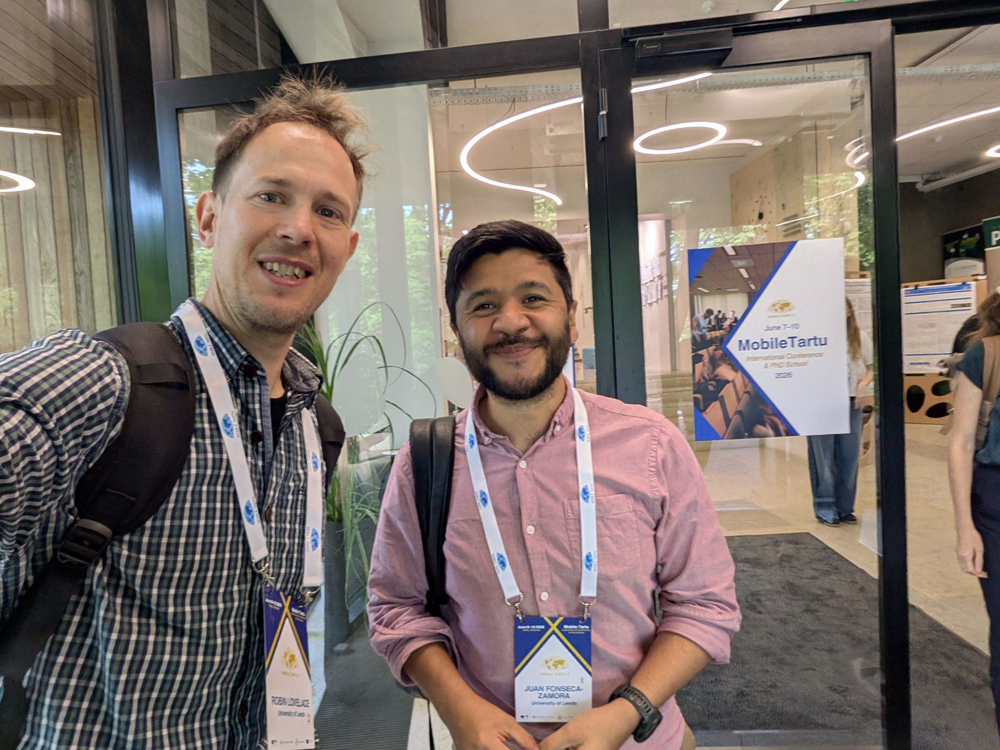

Last week I attended the [10th Mobile Tartu Conference](https://mobiletartu.ut.ee/).
In this post I share some reflections on the event, links to some of the great materials presented there, plus a few photos.
After reading it you should have a good idea about what Mobile Tartu is all about and, if you're a mobility researcher interested in emerging data sources and reproducible research, why you should consider applying to attend the next one in 2028.

The short version: it was a blast and you should go!

I first attended Mobile Tartu 2 years previously as an invited speaker for Mobile Tartu 2024.
This year, I was invited to [deliver a workshop ](https://robinlovelace.net/events/mobile-tartu-2026/)for the summer school that precedes the conference.
I was very happy to accept, resulting in the 2 half-day course Data Science for Transport Planning delivered by me and my ITS colleague and PhD student Juan Fonseca, shown in the photo above.

Before the event we got to spend some time exploring Tallinn.
There was an outdoor festival taking place, which featured live music, the ideal way to acclimatise to the Estonian culture.
Although I couldn't understand a single word of the lyrics I could appreciate the catchy and brilliantly executed songs.
It was only several days later that I found out that it was an Estonian-language progressive pop band called [Lonitseera](https://lonitseera.ee/eng/meist/).
Their music is available from their [website](https://lonitseera.ee/eng/muusika/), from [YouTube ](https://www.youtube.com/@lonitseera1403)and beyond, highly recommended!

The next day, on Sunday 7th June, it was time to go to the PhD school venue.
I found time to go for a quick run in the morning, and ended up at [Linnahall](https://en.wikipedia.org/wiki/Linnahall), a largely abandoned venue constructed for the 1980 Olympic games.
Climbing up the huge concrete structure gave me an impression of how much Tallinn, and the whole of Estonia, has changed since regaining independence following a referendum in which almost [80% of its population voted for independence from the former Soviet Union in 1991](https://en.wikipedia.org/wiki/Estonia#Independence_restored).

We arrived at the venue, an Ice Age museum with impressive sculptures of Woolly Mamoths and more.
The venue was also on the edge of a lake ([Saadjärv](https://www.openstreetmap.org/relation/4567875#map=14/58.54080/26.64974&layers=C)) which was the ideal place to cool off after taking a sauna to celebrate completing the first day's work.
As ice-breaker activities, we were asked to create a map of the world in the space shown below and find things we had in common.
This was a great way to get to know each other and to see the impressive international spread of participants.

Before the workshops began there was a workshop.